# Architecture Tour - Zagalin Plugin

A visual walkthrough of how this plugin works, with ASCII diagrams and code pointers.

## High-Level Architecture

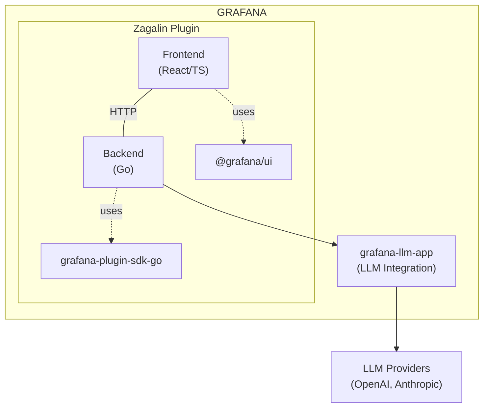

**Key Points**:

- Frontend: React 18 + TypeScript
- Backend: Go 1.21+ (runs as subprocess)
- Communication: HTTP via Grafana Plugin SDK
- LLM: Proxied through grafana-llm-app

## Directory Structure

```
jorgeancal-zagalin-app/

 src/                          # Frontend (React/TypeScript)
    components/               # React components
       App/                  # Main app component
       AppConfig/            # Configuration UI
       FloatingChat/         # Global floating chat button
       AskPanel/             # Dashboard panel component

    pages/                    # Page components
       ChatPage.tsx          # Full-screen chat interface
       ConfigPage/           # Plugin configuration
       AssistantChatPage.tsx # AI assistant chat

    services/                 # Business logic
       conversationStorage.ts    # Dual-tier storage
       contextService.ts         # Extract Grafana context
       assistantService.ts       # LLM API client
       zagalinTools.ts           # Function calling handlers

    hooks/                    # Custom React hooks
    types/                    # TypeScript type definitions
    module.tsx                # Plugin entry point

 pkg/                          # Backend (Go)
    main.go                   # Binary entry point
    plugin/
        app.go                # Main plugin app
        resources.go          # HTTP route handlers
        storage.go            # Conversation storage
        guardrails.go         # Rate limiting
        assistant.go          # LLM chat endpoint
        assistant_prompts.go  # System prompts (secure)
        assistant_tools.go    # Function calling tools
        llm_client.go         # grafana-llm-app client
        query_proxy.go        # Query security pipeline
        query_validation.go   # Query injection prevention
        datasource.go         # Datasource type detection
        otel_enforcement.go   # OTel scope enforcement
        context/              # Context extraction
            manager.go        # Context manager
            metrics.go        # Prometheus integration
            logs.go           # Loki integration
            traces.go         # Tempo integration

 tests/                        # E2E tests (Playwright)
    appNavigation.spec.ts
    appConfig.spec.ts

 docs/                         # Documentation
    FEATURES_OVERVIEW.md
    api/ENDPOINTS.md
    development/architecture.md

 .claude/                      # AI assistant configuration
     CLAUDE.md
     QUICK_START.md
     DECISION_TREES.md
     rules/                    # Modular standards
```

**Code Volume**:

- Frontend: ~3,725 lines (services)
- Backend: ~7,887 lines
- Total: 11,600+ lines of code

## Request Flow Diagrams

### 1. User Sends Chat Message

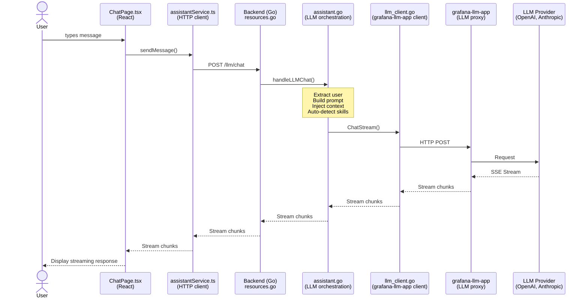

**Files**:

- Frontend: `src/pages/ChatPage.tsx:45-78`
- Service: `src/services/assistantService.ts:89-120`
- Backend: `pkg/plugin/assistant.go:123-234`
- LLM Client: `pkg/plugin/llm_client.go:67-145`

### 2. Query Execution with Security Pipeline

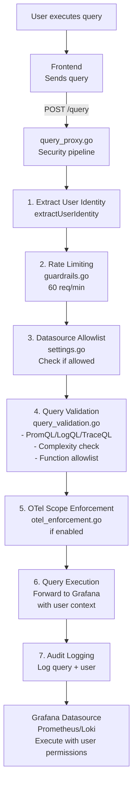

**Security Layers**:

1. **Rate Limiting**: 60 req/min per user (token bucket)
2. **Allowlist**: Only approved datasources
3. **Validation**: Injection prevention, complexity check
4. **OTel**: Scope enforcement (if enabled)
5. **Audit**: Full logging with user identity

**Files**:

- Pipeline: `pkg/plugin/query_proxy.go:156-289`
- Validation: `pkg/plugin/query_validation.go:45-450`
- Rate Limiting: `pkg/plugin/guardrails.go:78-134`

### 3. Context Extraction & Caching

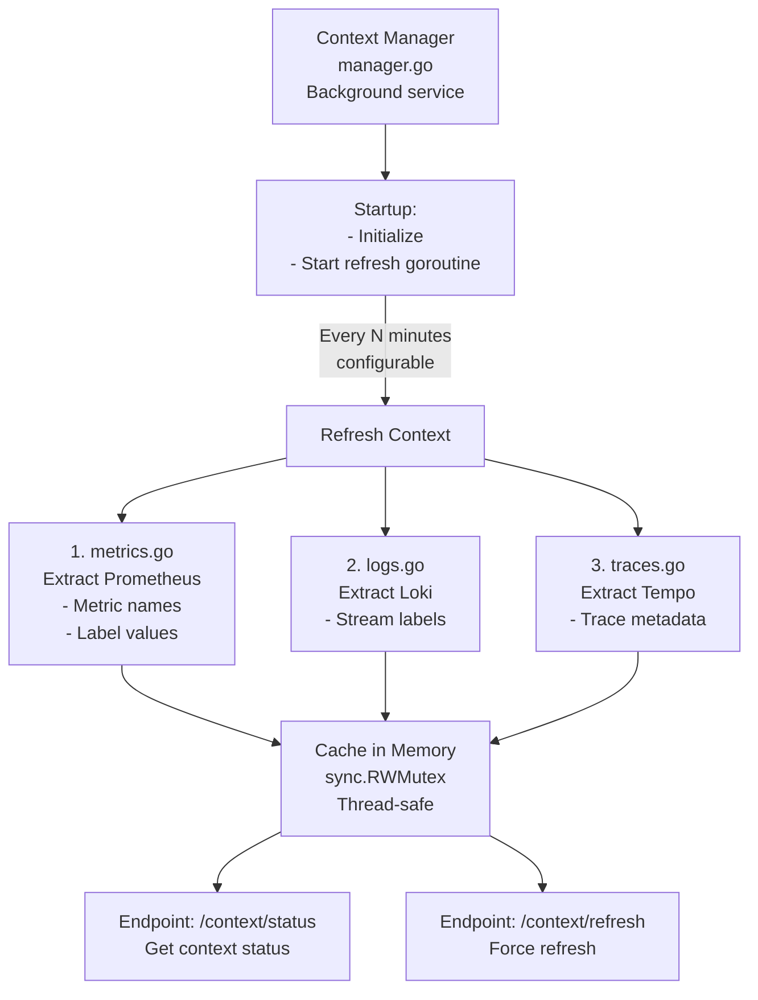

**Purpose**: Reduce LLM token usage by pre-extracting context

**Files**:

- Manager: `pkg/plugin/context/manager.go:34-189`
- Prometheus: `pkg/plugin/context/metrics.go:23-145`
- Loki: `pkg/plugin/context/logs.go:19-98`
- Tempo: `pkg/plugin/context/traces.go:21-87`

### 4. Dual-Tier Storage System

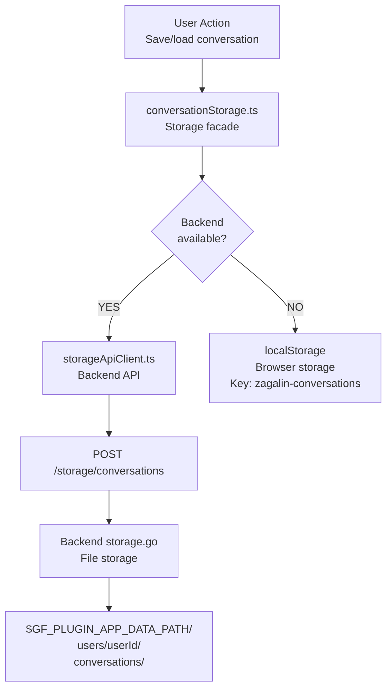

**Fallback Strategy**:

1. Try backend storage (preferred)
2. If unavailable, use localStorage
3. Auto-migrate localStorage → backend when available

**Files**:

- Facade: `src/services/conversationStorage.ts:23-167`
- API Client: `src/services/storageApiClient.ts:19-89`
- Backend: `pkg/plugin/storage.go:34-234`

## Frontend Architecture

### Component Hierarchy

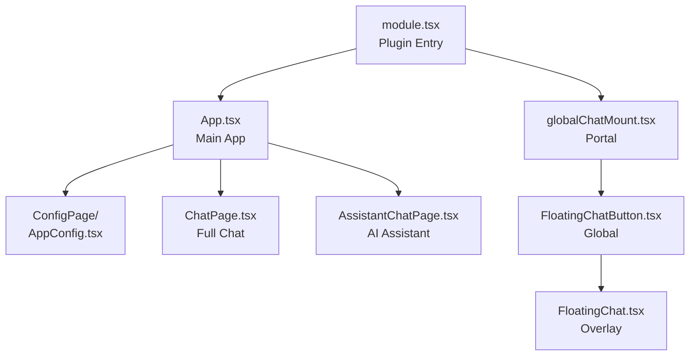

**Key Pattern**: **Portal Mounting**

- `globalChatMount.tsx` creates global div
- Mounts once when module loads
- Persists across Grafana navigation
- Only shows on dashboard pages

**File**: `src/globalChatMount.tsx:12-45`

### State Management

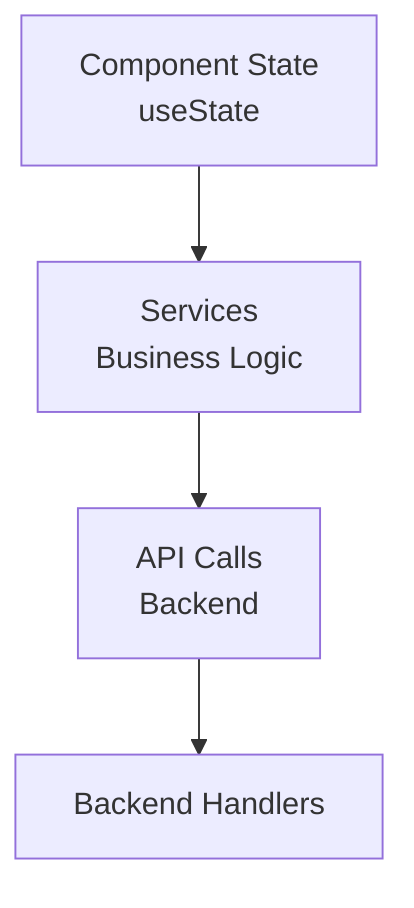

**No Redux/MobX** - Simple useState + services pattern

### Services Layer

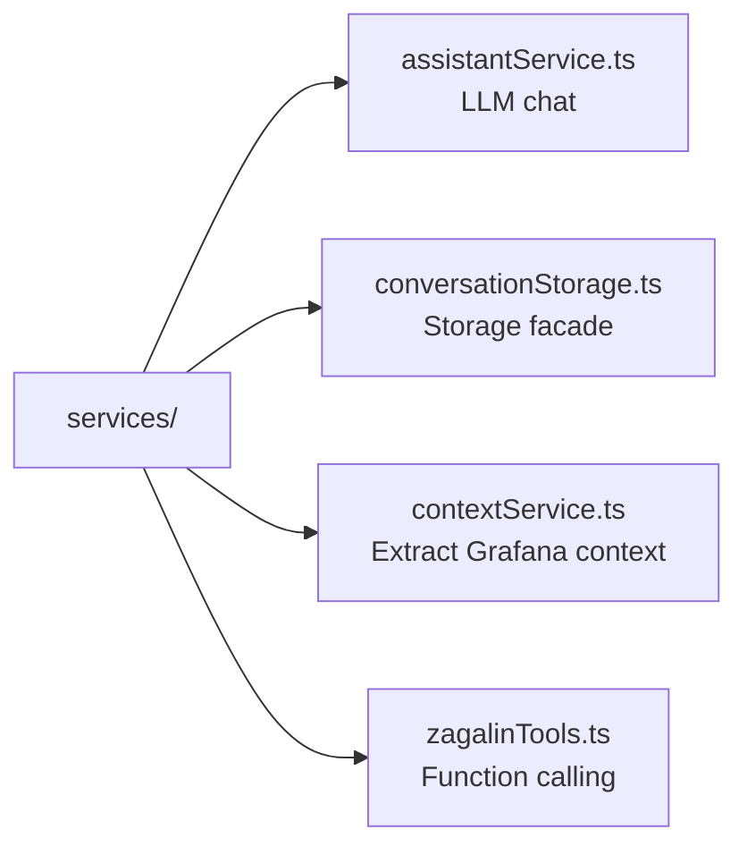

**Purpose**: Separate business logic from UI

## Backend Architecture

### Main Components

```mermaid
graph TD
    App[app.go<br/>Main Plugin]
    App --> Resources[resources.go<br/>HTTP Router]
    App --> Guardrails[guardrails.go<br/>Rate Limiting]
    App --> Validation[query_validation.go<br/>Security]
    App --> ContextBg[context/<br/>Background Service]

    Resources --> LLM[/llm/chat → assistant.go]
    Resources --> Query[/query → query_proxy.go]
    Resources --> Storage[/storage/* → storage.go]
    Resources --> ContextAPI[/context/* → context/manager.go]
    Resources --> Health[/health → health check]

    ContextBg --> Manager[manager.go]
    ContextBg --> Metrics[metrics.go]
    ContextBg --> Logs[logs.go]
    ContextBg --> Traces[traces.go]
```

### HTTP Handler Pattern

```go
// resources.go routes to specific handlers
func (a *App) CallResource(ctx, req, sender) error {
    switch req.Path {
    case "llm/chat":
        return a.handleLLMChat(ctx, req, sender)
    case "query":
        return a.handleQuery(ctx, req, sender)
    // ...
    }
}

// Each handler:
// 1. Extract user identity
// 2. Validate input
// 3. Apply security checks
// 4. Execute operation
// 5. Return response
```

**Pattern**: Resource handler per feature

## Security Architecture

### Multi-Layer Defense

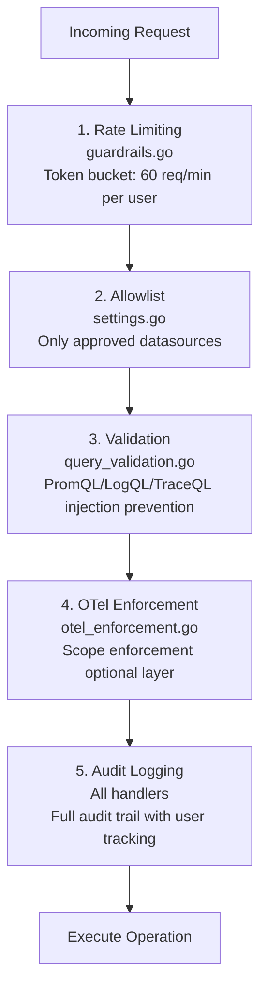

**Defense in Depth**: Multiple independent layers

## Testing Architecture

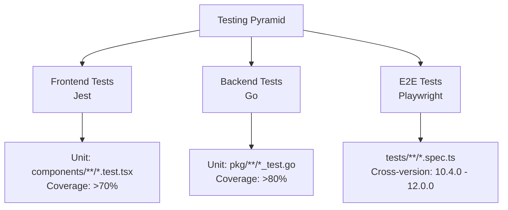

**Test Pyramid**:

- Many unit tests (fast, isolated)
- Some E2E tests (slow, integrated)
- Critical paths: 100% coverage

## Build Architecture

### Frontend Build (Webpack)

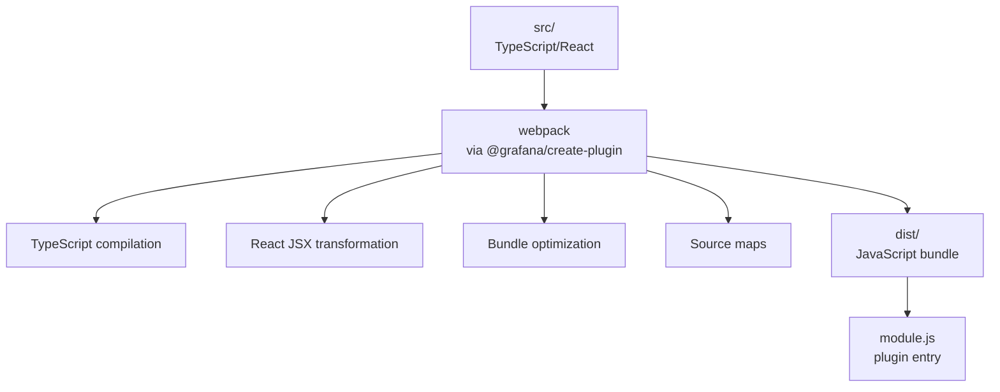

**Build**: `npm run build`
**Dev**: `npm run dev` (watch mode)

### Backend Build (Mage)

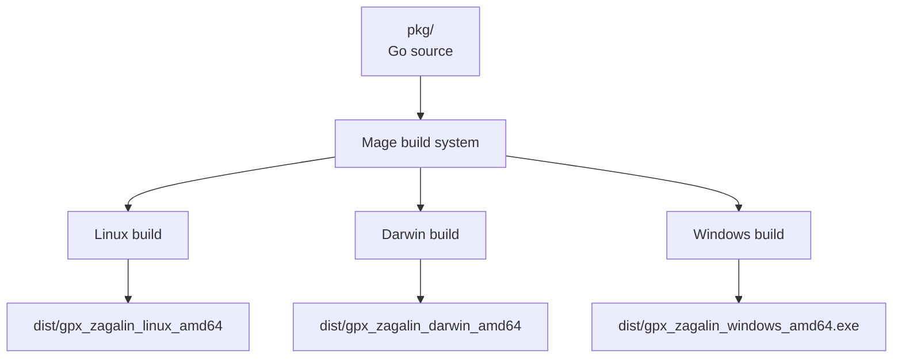

**Build**: `mage -v buildAll`
**Test**: `mage -v coverage`

## Integration Points

### With Grafana

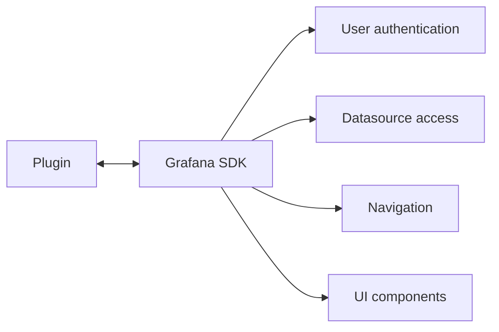

### With grafana-llm-app

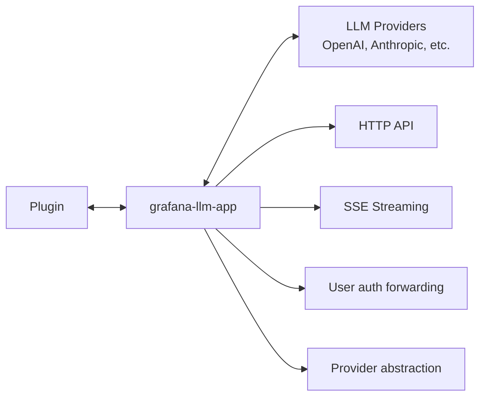

### With Datasources

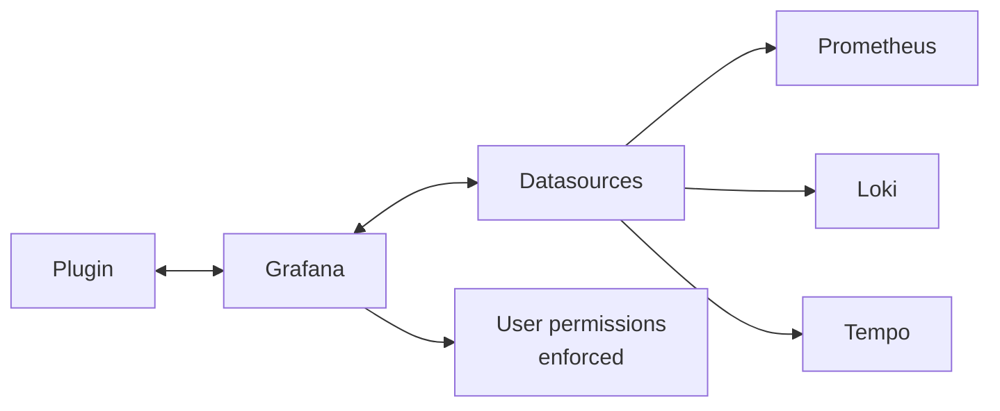

## Critical Files by Feature

### LLM Chat

- Frontend: `src/pages/ChatPage.tsx`
- Service: `src/services/assistantService.ts`
- Backend: `pkg/plugin/assistant.go`
- Client: `pkg/plugin/llm_client.go`
- Tools: `pkg/plugin/assistant_tools.go`

### Query Security

- Handler: `pkg/plugin/query_proxy.go`
- Validation: `pkg/plugin/query_validation.go`
- Rate Limit: `pkg/plugin/guardrails.go`
- OTel: `pkg/plugin/otel_enforcement.go`

### Storage

- Frontend: `src/services/conversationStorage.ts`
- Backend: `pkg/plugin/storage.go`

### Context

- Manager: `pkg/plugin/context/manager.go`
- Prometheus: `pkg/plugin/context/metrics.go`
- Loki: `pkg/plugin/context/logs.go`

## Performance Characteristics

**Frontend**:

- Bundle size: <1 MB (gzipped)
- Initial load: <3 seconds
- React hot reload: <1 second

**Backend**:

- Memory: <100 MB per instance
- CPU: <50% average
- Query latency: <200ms (p95)

**LLM**:

- Streaming: Real-time SSE
- Context injection: <100ms overhead
- Token optimization: Context pre-extraction

## Data Flow Summary

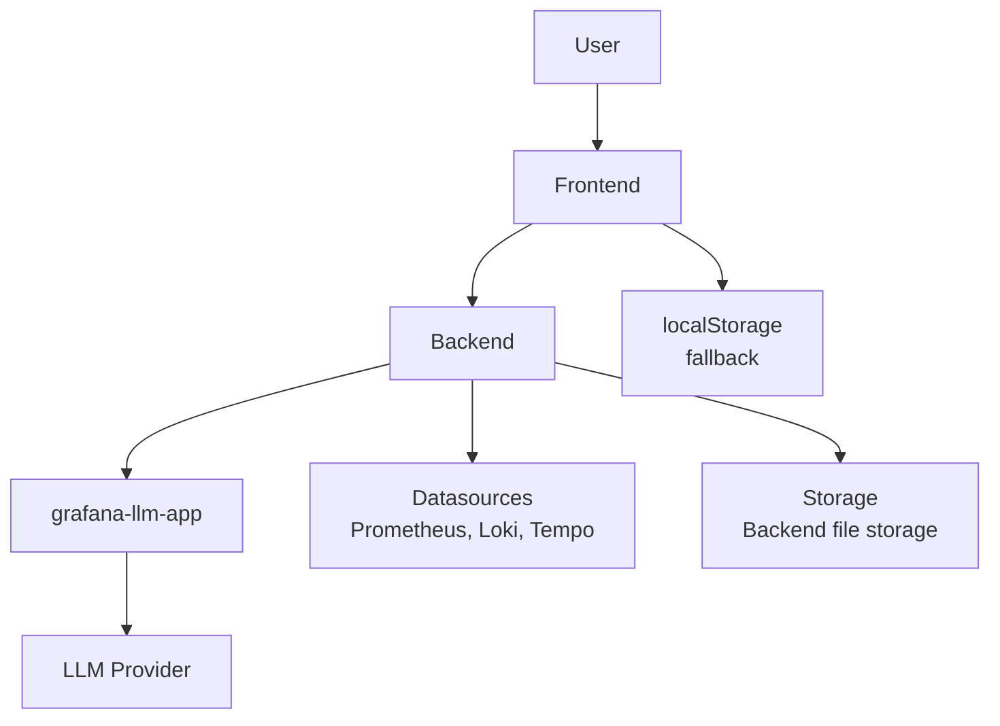

**Key Patterns**:

- Backend proxy for security
- Dual-tier storage for reliability
- Context caching for performance
- Streaming for UX

---

## Next Steps

**Understand specific areas**:

- Frontend tour: `.claude/rules/00-getting-started/frontend-tour.md`
- Backend tour: `.claude/rules/00-getting-started/backend-tour.md`
- Common tasks: `.claude/rules/00-getting-started/common-tasks.md`

**Deep dive**:

- LLM integration: `.claude/rules/03-integrations/llm-official.md`
- Security pipeline: `.claude/rules/01-grafana-standards/security.md`
- Testing: `.claude/rules/02-development/testing.md`

---

**Last Updated**: 2026-01-10
**Plugin Version**: 0.0.5
**Architecture Version**: 2.0 (hybrid app plugin)
