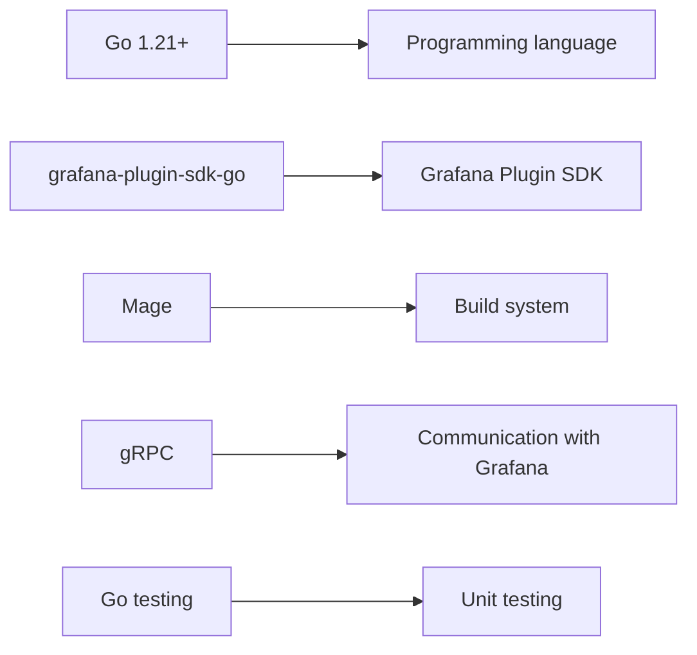
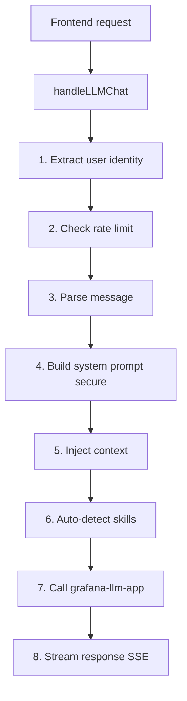
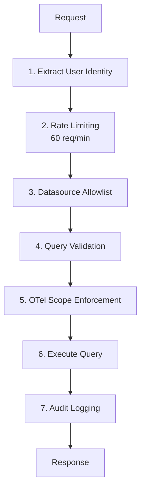

# Backend Tour - Go

A guided tour of the backend codebase for this plugin. Perfect for backend developers getting started.

## Backend Stack



## Directory Structure

```
pkg/
 main.go                      # Binary entry point
 plugin/
     app.go                   # Main plugin app
     resources.go             # HTTP route handlers
     settings.go              # Configuration

     storage.go               # Conversation storage
     guardrails.go            # Rate limiting

     assistant.go             # LLM orchestration
     assistant_prompts.go     # System prompts
     assistant_tools.go       # Function calling tools
     llm_client.go            # grafana-llm-app client

     query_proxy.go           # Query security pipeline
     query_validation.go      # Injection prevention
     datasource.go            # Datasource detection
     otel_enforcement.go      # OTel scope enforcement

     context/                 # Context extraction
         manager.go           # Context manager
         metrics.go           # Prometheus
         logs.go              # Loki
         traces.go            # Tempo
```

**Code Volume**: ~7,887 lines

## Entry Point

### main.go - Plugin Bootstrap

**File**: `pkg/main.go`

```go
package main

import (
    "os"
    "github.com/grafana/grafana-plugin-sdk-go/backend/app"
    "github.com/jorgeancal/zagalin/pkg/plugin"
)

func main() {
    if err := app.Manage(
        "jorgeancal-zagalin-app",
        plugin.NewApp,
        app.ManageOpts{},
    ); err != nil {
        os.Exit(1)
    }
}
```

**What happens**:

1. Grafana launches this binary as subprocess
2. Communication via gRPC
3. `plugin.NewApp` creates plugin instance
4. SDK manages lifecycle

### app.go - Plugin Instance

**File**: `pkg/plugin/app.go`

```go
type App struct {
    backend.CallResourceHandler

    settings             *Settings
    contextManager       *context.Manager
    rateLimiter          *RateLimiter
    queryValidator       *QueryValidator
    // ... more fields
}

func NewApp(ctx context.Context, settings backend.AppInstanceSettings) (
    instancemgmt.Instance, error,
) {
    // 1. Load settings
    appSettings, err := LoadSettings(settings)
    if err != nil {
        return nil, err
    }

    // 2. Initialize context manager
    contextMgr := context.NewManager(appSettings, settings.GrafanaAPIURL)
    contextMgr.Start(ctx) // Background goroutine

    // 3. Initialize rate limiter
    rateLimiter := NewRateLimiter(appSettings.RateLimit)

    // 4. Initialize query validator
    validator := NewQueryValidator(
        appSettings.QueryValidation.MaxQueryComplexity,
        appSettings.QueryValidation.AllowedFunctions,
        appSettings.QueryValidation.StrictMode,
    )

    return &App{
        settings:       appSettings,
        contextManager: contextMgr,
        rateLimiter:    rateLimiter,
        queryValidator: validator,
    }, nil
}
```

**Key Points**:

- One instance per organization
- Initialized with settings
- Background services started
- Rate limiters per instance

## HTTP Resource Handlers

### resources.go - Router

**File**: `pkg/plugin/resources.go:1-100`

```go
func (a *App) CallResource(
    ctx context.Context,
    req *backend.CallResourceRequest,
    sender backend.CallResourceResponseSender,
) error {
    log.DefaultLogger.Info("CallResource", "path", req.Path)

    switch req.Path {
    case "health":
        return a.handleHealth(ctx, req, sender)

    case "llm/chat":
        return a.handleLLMChat(ctx, req, sender)

    case "query":
        return a.handleQuery(ctx, req, sender)

    case "storage/conversations":
        return a.handleStorageConversations(ctx, req, sender)

    case "context/status":
        return a.handleContextStatus(ctx, req, sender)

    case "context/refresh":
        return a.handleContextRefresh(ctx, req, sender)

    default:
        return sender.Send(&backend.CallResourceResponse{
            Status: http.StatusNotFound,
            Body:   []byte(`{"error": "endpoint not found"}`),
        })
    }
}
```

**Pattern**: Switch on path, delegate to handlers

**URL Format**:

```
/api/plugins/jorgeancal-zagalin-app/resources/{path}
```

## LLM Integration

### assistant.go - LLM Orchestration

**File**: `pkg/plugin/assistant.go:1-300`

**Flow**:



**Key Method**:

```go
func (a *App) handleLLMChat(
    ctx context.Context,
    req *backend.CallResourceRequest,
    sender backend.CallResourceResponseSender,
) error {
    // 1. Extract user
    user, err := extractUserIdentity(ctx)
    if err != nil {
        return sendError(sender, http.StatusUnauthorized, "unauthorized")
    }

    // 2. Rate limiting
    if !a.rateLimiter.Allow(user.UserID) {
        return sendError(sender, http.StatusTooManyRequests, "rate limit")
    }

    // 3. Parse request
    var chatReq ChatRequest
    json.Unmarshal(req.Body, &chatReq)

    // 4. Build secure system prompt
    systemPrompt := buildSystemPrompt(a.settings)

    // 5. Inject context (if available)
    context := a.contextManager.GetContext()
    if context != nil {
        chatReq.Messages = injectContext(chatReq.Messages, context)
    }

    // 6. Auto-detect skills
    tools := detectSkills(chatReq.Messages, a.settings)

    // 7. Call LLM via grafana-llm-app
    stream, err := a.llmClient.ChatStream(ctx, LLMRequest{
        Model:    a.settings.LLMModel,
        Messages: chatReq.Messages,
        Tools:    tools,
    })

    // 8. Stream response via SSE
    return streamResponse(sender, stream)
}
```

**Why backend handles LLM**:

- Secure system prompts (not exposed to frontend)
- Context injection from datasources
- Rate limiting and governance
- Audit logging with user identity

### assistant_prompts.go - System Prompts

**File**: `pkg/plugin/assistant_prompts.go:1-150`

**Purpose**: Construct secure system prompts

```go
func buildSystemPrompt(settings *Settings) string {
    return `You are a Senior Staff SRE assistant for Grafana.

Your capabilities:
- Query Prometheus metrics with PromQL
- Query Loki logs with LogQL
- Analyze dashboards and panels
- Troubleshoot issues
- Generate queries

Context will be provided about:
- Current dashboard
- Available metrics and labels
- Log streams
- Time range

IMPORTANT:
- Always validate queries before suggesting
- Explain your reasoning
- Ask for clarification if needed
- Be concise but thorough
`
}
```

**Why on backend**:

- User can't see/modify prompts
- Can inject sensitive context
- Centralized control

### llm_client.go - grafana-llm-app Client

**File**: `pkg/plugin/llm_client.go:1-200`

**Purpose**: HTTP client for grafana-llm-app

**Key Methods**:

```go
type LLMClient struct {
    httpClient *http.Client
    baseURL    string
}

func (c *LLMClient) ChatStream(
    ctx context.Context,
    req LLMRequest,
) (io.ReadCloser, error) {
    // Build request
    body, _ := json.Marshal(req)
    httpReq, _ := http.NewRequestWithContext(
        ctx,
        "POST",
        c.baseURL+"/api/plugins/grafana-llm-app/resources/llm/chat",
        bytes.NewReader(body),
    )

    // Forward user auth
    httpReq.Header.Set("X-Grafana-User", req.UserID)
    httpReq.Header.Set("X-Grafana-Org-ID", req.OrgID)

    // Execute
    resp, err := c.httpClient.Do(httpReq)
    if err != nil {
        return nil, err
    }

    // Return SSE stream
    return resp.Body, nil
}
```

**SSE Stream Format**:

```
data: {"choices":[{"delta":{"content":"Hello"}}]}

data: {"choices":[{"delta":{"content":" world"}}]}

data: [DONE]
```

### assistant_tools.go - Function Calling

**File**: `pkg/plugin/assistant_tools.go:1-250`

**Purpose**: Define tools LLM can use

```go
type Tool struct {
    Type     string             `json:"type"`
    Function FunctionDefinition `json:"function"`
}

func getAvailableTools(ctx context.Context, settings *Settings) []Tool {
    tools := []Tool{
        {
            Type: "function",
            Function: FunctionDefinition{
                Name: "query_prometheus",
                Description: "Execute a PromQL query",
                Parameters: ParametersDefinition{
                    Type: "object",
                    Properties: map[string]PropertyDefinition{
                        "query": {
                            Type:        "string",
                            Description: "PromQL expression",
                        },
                        "datasource": {
                            Type:        "string",
                            Description: "Datasource UID",
                        },
                    },
                    Required: []string{"query", "datasource"},
                },
            },
        },
        // More tools...
    }

    return tools
}
```

**Tool Execution** (handled by frontend):

- Backend defines available tools
- LLM requests tool execution
- Frontend executes via `zagalinTools.ts`
- Result returned to LLM

## Security Pipeline

### query_proxy.go - Query Security

**File**: `pkg/plugin/query_proxy.go:1-300`

**Pipeline**:



**Implementation**:

```go
func (a *App) handleQuery(
    ctx context.Context,
    req *backend.CallResourceRequest,
    sender backend.CallResourceResponseSender,
) error {
    // 1. Extract user
    user, err := extractUserIdentity(ctx)
    if err != nil {
        return sendError(sender, http.StatusUnauthorized, "unauthorized")
    }

    // 2. Rate limiting
    if !a.rateLimiter.Allow(user.UserID) {
        a.logRateLimitExceeded(user)
        return sendError(sender, http.StatusTooManyRequests, "rate limit")
    }

    // 3. Parse query
    var queryReq QueryRequest
    json.Unmarshal(req.Body, &queryReq)

    // 4. Datasource allowlist
    if !a.isDatasourceAllowed(queryReq.DatasourceUID) {
        return sendError(sender, http.StatusForbidden, "datasource not allowed")
    }

    // 5. Query validation
    if a.settings.QueryValidation.Enabled {
        dsType := a.getDatasourceType(queryReq.DatasourceUID)
        result := a.queryValidator.ValidateQuery(queryReq.Query, dsType)

        if !result.Valid {
            a.logQueryValidationFailure(user, queryReq, result)
            return sendError(sender, http.StatusBadRequest, "invalid query")
        }
    }

    // 6. OTel enforcement (if enabled)
    if a.settings.OTelEnforcement.Enabled {
        if err := enforceOTelScope(queryReq.Query, a.settings); err != nil {
            return sendError(sender, http.StatusForbidden, err.Error())
        }
    }

    // 7. Execute query (forward to Grafana with user context)
    result, err := a.executeQuery(ctx, user, queryReq)
    if err != nil {
        return sendError(sender, http.StatusInternalServerError, "query failed")
    }

    // 8. Audit log
    a.logQueryExecution(user, queryReq, result)

    // Return result
    body, _ := json.Marshal(result)
    return sender.Send(&backend.CallResourceResponse{
        Status: http.StatusOK,
        Body:   body,
    })
}
```

**Defense in Depth**: Multiple independent layers

### query_validation.go - Injection Prevention

**File**: `pkg/plugin/query_validation.go:1-450`

**Validates**: PromQL, LogQL, TraceQL

**Pattern-Based Validation**:

```go
func (v *QueryValidator) validatePromQL(query string) *ValidationResult {
    result := &ValidationResult{Valid: true}

    // 1. Balanced braces
    if !hasBalancedBraces(query) {
        result.Valid = false
        result.Violations = append(result.Violations, Violation{
            Type: "syntax",
            Message: "unbalanced braces",
        })
    }

    // 2. Invalid operators
    invalidOps := []string{"===", "!==", "<>", "++", "--"}
    for _, op := range invalidOps {
        if strings.Contains(query, op) {
            result.Valid = false
            result.Violations = append(result.Violations, Violation{
                Type: "syntax",
                Message: fmt.Sprintf("invalid operator: %s", op),
            })
        }
    }

    // 3. Complexity check
    complexity := estimateComplexity(query)
    if complexity > v.MaxQueryComplexity {
        result.Valid = false
        result.Violations = append(result.Violations, Violation{
            Type: "complexity",
            Message: "query too complex",
        })
    }

    // 4. Function allowlist
    if len(v.AllowedFunctions) > 0 {
        if !allFunctionsAllowed(query, v.AllowedFunctions) {
            result.Valid = false
            result.Violations = append(result.Violations, Violation{
                Type: "function_blocked",
                Message: "disallowed function used",
            })
        }
    }

    return result
}
```

**No External Dependencies**: Manual pattern matching for small binary size

### guardrails.go - Rate Limiting

**File**: `pkg/plugin/guardrails.go:1-150`

**Token Bucket Algorithm**:

```go
type RateLimiter struct {
    limiters map[string]*rate.Limiter
    mu       sync.RWMutex
}

func NewRateLimiter(requestsPerMinute int) *RateLimiter {
    return &RateLimiter{
        limiters: make(map[string]*rate.Limiter),
    }
}

func (r *RateLimiter) Allow(userID string) bool {
    r.mu.Lock()
    defer r.mu.Unlock()

    limiter, exists := r.limiters[userID]
    if !exists {
        // Create limiter: 60 req/min
        limiter = rate.NewLimiter(rate.Limit(60.0/60.0), 60)
        r.limiters[userID] = limiter
    }

    return limiter.Allow()
}
```

**Per-User Limiting**: Each user has independent bucket

## Storage

### storage.go - File-Based Storage

**File**: `pkg/plugin/storage.go:1-250`

**Storage Path**:

```
$GF_PLUGIN_APP_DATA_PATH/
 users/
     {userID}/
         conversations/
             conversation-1.json
             conversation-2.json
             ...
```

**Implementation**:

```go
func (a *App) saveConversation(
    userID string,
    conv *Conversation,
) error {
    // Build path
    userDir := filepath.Join(
        a.pluginDataPath,
        "users",
        userID,
        "conversations",
    )

    // Create directories
    os.MkdirAll(userDir, 0755)

    // Write file
    filename := fmt.Sprintf("%s.json", conv.ID)
    filepath := filepath.Join(userDir, filename)

    data, _ := json.MarshalIndent(conv, "", "  ")
    return ioutil.WriteFile(filepath, data, 0644)
}
```

**Security**:

- Per-user directories
- No cross-user access
- File permissions: 0644 (user read/write)

## Context Manager

### context/manager.go - Background Service

**File**: `pkg/plugin/context/manager.go:1-200`

**Architecture**:

```
manager.Start()

     goroutine (runs forever)

         Every N minutes:
             Extract Prometheus metrics
             Extract Loki streams
             Extract Tempo traces
             Cache in memory
```

**Implementation**:

```go
type Manager struct {
    settings   *Settings
    cache      *ContextCache
    mu         sync.RWMutex
    stopChan   chan struct{}
}

func (m *Manager) Start(ctx context.Context) {
    go m.refreshLoop(ctx)
}

func (m *Manager) refreshLoop(ctx context.Context) {
    ticker := time.NewTicker(m.settings.RefreshInterval)
    defer ticker.Stop()

    // Initial refresh
    m.refresh(ctx)

    for {
        select {
        case <-ticker.C:
            m.refresh(ctx)
        case <-m.stopChan:
            return
        case <-ctx.Done():
            return
        }
    }
}

func (m *Manager) refresh(ctx context.Context) {
    // 1. Extract Prometheus metrics
    metrics, err := m.extractMetrics(ctx)
    if err != nil {
        log.DefaultLogger.Error("Failed to extract metrics", "error", err)
    }

    // 2. Extract Loki streams
    logs, err := m.extractLogs(ctx)
    if err != nil {
        log.DefaultLogger.Error("Failed to extract logs", "error", err)
    }

    // 3. Extract Tempo traces
    traces, err := m.extractTraces(ctx)
    if err != nil {
        log.DefaultLogger.Error("Failed to extract traces", "error", err)
    }

    // 4. Update cache (thread-safe)
    m.mu.Lock()
    m.cache = &ContextCache{
        Metrics:   metrics,
        Logs:      logs,
        Traces:    traces,
        UpdatedAt: time.Now(),
    }
    m.mu.Unlock()
}

func (m *Manager) GetContext() *ContextCache {
    m.mu.RLock()
    defer m.mu.RUnlock()
    return m.cache
}
```

**Benefits**:

- Reduces LLM token usage
- Pre-extracted context ready
- Background refresh (non-blocking)

### context/metrics.go - Prometheus

**File**: `pkg/plugin/context/metrics.go:1-150`

**Extracts**:

- Metric names
- Label names
- Label values (sampled)

```go
func (m *Manager) extractMetrics(ctx context.Context) ([]Metric, error) {
    // Query Prometheus metadata API
    resp, err := m.queryMetadata("/api/v1/label/__name__/values")

    // Parse metric names
    var metricNames []string
    json.Unmarshal(resp, &metricNames)

    // For each metric, get labels
    metrics := []Metric{}
    for _, name := range metricNames {
        labels, _ := m.getLabelsForMetric(name)
        metrics = append(metrics, Metric{
            Name:   name,
            Labels: labels,
        })
    }

    return metrics, nil
}
```

## Testing Backend

### Unit Tests

**File**: `pkg/plugin/query_validation_test.go`

```go
func TestValidatePromQL(t *testing.T) {
    validator := NewQueryValidator(50, []string{}, true)

    tests := []struct {
        name      string
        query     string
        wantValid bool
    }{
        {
            name:      "valid query",
            query:     "up",
            wantValid: true,
        },
        {
            name:      "unbalanced braces",
            query:     "up{job=",
            wantValid: false,
        },
        {
            name:      "complexity exceeded",
            query:     strings.Repeat("up + ", 100),
            wantValid: false,
        },
    }

    for _, tt := range tests {
        t.Run(tt.name, func(t *testing.T) {
            result := validator.ValidateQuery(tt.query, "promql")

            if result.Valid != tt.wantValid {
                t.Errorf("got valid=%v, want %v", result.Valid, tt.wantValid)
            }
        })
    }
}
```

**Run tests**:

```bash
# All tests
go test ./...

# With coverage
mage -v coverage

# Specific package
go test ./pkg/plugin -v
```

## Best Practices

### DO:

- Extract user identity in every handler
- Validate all input
- Use structured logging
- Handle errors explicitly
- Write table-driven tests
- Use contexts for cancellation
- Lock shared state (sync.RWMutex)
- Close resources (defer)

### DON'T:

- Trust frontend input
- Ignore errors
- Use panic() in handlers
- Store user credentials
- Log sensitive data
- Block goroutines indefinitely
- Use global state
- Skip tests

## Debugging Backend

### Logging

```go
import "github.com/grafana/grafana-plugin-sdk-go/backend/log"

log.DefaultLogger.Info("Message", "key", value)
log.DefaultLogger.Warn("Warning", "error", err)
log.DefaultLogger.Error("Error", "error", err)
```

### View Logs

```bash
# Docker logs
docker logs jorgeancal-zagalin-app

# Follow logs
docker logs -f jorgeancal-zagalin-app

# Or check Grafana log directory
```

### Debugging with Delve

```bash
# Install delve
go install github.com/go-delve/delve/cmd/dlv@latest

# Debug tests
dlv test ./pkg/plugin

# Set breakpoint
(dlv) break pkg/plugin/assistant.go:123
(dlv) continue
```

## Key Files Reference

| Feature           | File                             |
| ----------------- | -------------------------------- |
| Entry point       | `pkg/main.go`                    |
| Plugin app        | `pkg/plugin/app.go`              |
| HTTP router       | `pkg/plugin/resources.go`        |
| LLM handler       | `pkg/plugin/assistant.go`        |
| Security pipeline | `pkg/plugin/query_proxy.go`      |
| Validation        | `pkg/plugin/query_validation.go` |
| Rate limiting     | `pkg/plugin/guardrails.go`       |
| Storage           | `pkg/plugin/storage.go`          |
| Context manager   | `pkg/plugin/context/manager.go`  |
| Settings          | `pkg/plugin/settings.go`         |

## Next Steps

**Deep dive**:

- Frontend tour: `.claude/rules/00-getting-started/frontend-tour.md`
- Common tasks: `.claude/rules/00-getting-started/common-tasks.md`
- Architecture: `.claude/rules/00-getting-started/architecture-tour.md`

**Learn more**:

- Clean code: `.claude/rules/02-development/clean-code.md`
- Testing: `.claude/rules/02-development/testing.md`
- Security: `.claude/rules/01-grafana-standards/security.md`

---

**Last Updated**: 2026-01-10
**Backend Stack**: Go 1.21+ + grafana-plugin-sdk-go + Mage
