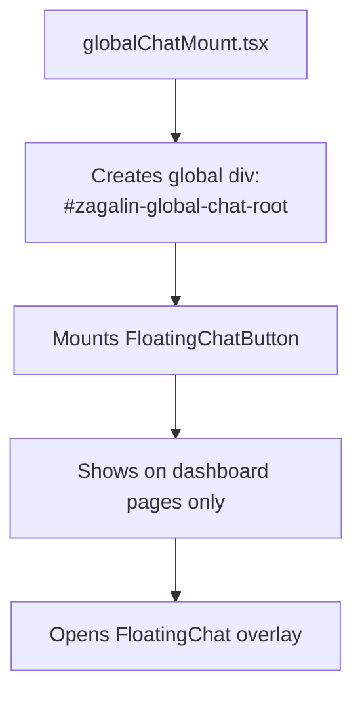
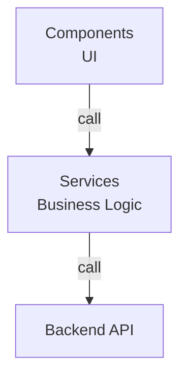
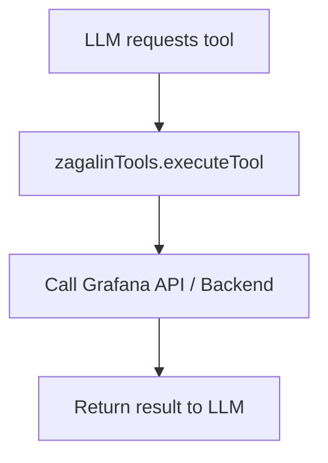

# Frontend Tour - React/TypeScript

A guided tour of the frontend codebase for this plugin. Perfect for frontend developers getting started.

##  Frontend Stack

```mermaid
graph LR
    React[React 18] --> UI[UI framework]
    TS[TypeScript 5.5] --> Safety[Type safety]
    GrafanaUI[@grafana/ui] --> Components[UI components]
    GrafanaData[@grafana/data] --> Structures[Data structures]
    GrafanaRuntime[@grafana/runtime] --> Integration[Grafana integration]
    RxJS[RxJS] --> Streaming[Streaming LLM responses]
    Webpack[Webpack 5] --> Build[Build system]
    Jest[Jest] --> UnitTest[Unit testing]
    Playwright[Playwright] --> E2E[E2E testing]
```

##  Directory Structure

```
src/
 components/          # React components
    App/            # Main app
    AppConfig/      # Configuration UI
    FloatingChat/   # Global floating button
    AskPanel/       # Panel plugin

 pages/              # Page-level components
    ChatPage.tsx
    ConfigPage/
    AssistantChatPage.tsx

 services/           # Business logic (NO UI)
    assistantService.ts      # LLM API client
    conversationStorage.ts   # Storage facade
    contextService.ts        # Grafana context
    zagalinTools.ts          # Function calling

 hooks/              # Custom React hooks
    useGrafanaContext.ts

 types/              # TypeScript types
    types.ts
    llm.types.ts

 constants.ts        # Constants (routes, etc.)
 plugin.json         # Plugin metadata
 module.tsx          # Plugin entry point
```

**Pattern**: Components (UI) ↔ Services (Logic) ↔ Backend (API)

##  Entry Point

### module.tsx - Plugin Registration

**File**: `src/module.tsx`

```typescript
import { AppPlugin } from '@grafana/data';
import { App } from './components/App';
import { AppConfig } from './components/AppConfig';

export const plugin = new AppPlugin<AppJsonData>()
  .setRootPage(App)
  .addConfigPage({
    title: 'Configuration',
    icon: 'cog',
    body: AppConfig,
    id: 'configuration',
  });
```

**Key Points**:
- Registers app plugin with Grafana
- Sets root page (`App`)
- Adds configuration page
- Grafana calls this on plugin load

##  Component Architecture

### App.tsx - Main Application

**File**: `src/components/App/App.tsx`

```mermaid
graph TD
    App[App<br/>Root]
    App --> Router[BrowserRouter]
    App --> Floating[FloatingChat<br/>if dashboard]

    Router --> Routes[Routes]
    Routes --> Root[/ → redirect to /chat]
    Routes --> Chat[/chat → ChatPage]
    Routes --> Config[/config → ConfigPage]
    Routes --> Assistant[/assistant → AssistantChatPage]
```

**Pattern**: React Router for navigation

### Page Components

#### ChatPage.tsx - Full-Screen Chat

**File**: `src/pages/ChatPage.tsx:1-200`

**What it does**:
- Full-screen chat interface
- Manages conversation state
- Streams LLM responses
- Handles message sending

**Key features**:
```typescript
// 1. State management
const [messages, setMessages] = useState<Message[]>([]);
const [isStreaming, setIsStreaming] = useState(false);

// 2. Send message
const sendMessage = async (text: string) => {
  // Add user message
  setMessages(prev => [...prev, { role: 'user', content: text }]);

  // Stream LLM response
  const stream$ = assistantService.streamChat(messages);
  stream$.subscribe({
    next: (chunk) => updateStreamingMessage(chunk),
    complete: () => setIsStreaming(false)
  });
};

// 3. Render messages
{messages.map(msg => (
  <MessageBubble
    key={msg.id}
    role={msg.role}
    content={msg.content}
  />
))}
```

**UI Components Used**:
- `<PluginPage>` - Page wrapper
- `<Stack>` - Layout
- `<Button>` - Actions
- `<TextArea>` - Input
- Custom `<MessageBubble>`

### FloatingChat - Global Chat Button

**Files**:
- `src/globalChatMount.tsx` - Portal mounting
- `src/components/FloatingChat/FloatingChatButton.tsx` - Button
- `src/components/FloatingChat/FloatingChat.tsx` - Overlay

**Architecture**:


**Key Pattern**: **Portal Mounting**
- Mounts once when plugin loads
- Persists across Grafana navigation
- Only visible on dashboard pages

**Detection**:
```typescript
// Check if on dashboard page
const isDashboardPage = window.location.pathname.includes('/d/');

if (isDashboardPage) {
  return <FloatingChatButton />;
}
```

##  Services Layer

### Pattern: Separation of Concerns



**Benefits**:
-  Testable logic (no UI dependencies)
-  Reusable across components
-  Single source of truth for API calls

### assistantService.ts - LLM Client

**File**: `src/services/assistantService.ts:1-150`

**Purpose**: API client for LLM chat

**Key Methods**:
```typescript
export const assistantService = {
  // Stream chat (SSE)
  streamChat(messages: Message[]): Observable<string> {
    return new Observable((observer) => {
      const eventSource = new EventSource('/api/plugins/.../llm/chat');

      eventSource.onmessage = (event) => {
        const data = JSON.parse(event.data);
        observer.next(data.content);
      };

      eventSource.onerror = () => {
        observer.error(new Error('Stream error'));
        eventSource.close();
      };
    });
  },

  // Non-streaming chat
  async chat(messages: Message[]): Promise<string> {
    const response = await getBackendSrv().post(
      '/api/plugins/jorgeancal-zagalin-app/resources/llm/chat',
      { messages }
    );
    return response.content;
  },
};
```

**Pattern**: Observable for streaming, Promise for single response

### conversationStorage.ts - Storage Facade

**File**: `src/services/conversationStorage.ts:1-170`

**Purpose**: Dual-tier storage (backend + localStorage)

**Architecture**:
```
conversationStorage
  
   Try backend first
      storageApiClient.ts
          POST /storage/conversations
  
   Fallback to localStorage
       localStorage.setItem('zagalin-conversations', ...)
```

**Key Methods**:
```typescript
export const conversationStorage = {
  async saveConversation(conv: Conversation): Promise<void> {
    try {
      // Try backend
      await storageApiClient.save(conv);
    } catch (error) {
      // Fallback to localStorage
      const stored = localStorage.getItem('zagalin-conversations');
      const conversations = stored ? JSON.parse(stored) : [];
      conversations.push(conv);
      localStorage.setItem('zagalin-conversations', JSON.stringify(conversations));
    }
  },

  async loadConversations(): Promise<Conversation[]> {
    try {
      return await storageApiClient.load();
    } catch (error) {
      const stored = localStorage.getItem('zagalin-conversations');
      return stored ? JSON.parse(stored) : [];
    }
  },
};
```

**Pattern**: Try-catch fallback strategy

### contextService.ts - Grafana Context Extraction

**File**: `src/services/contextService.ts:1-120`

**Purpose**: Extract context from Grafana (dashboard, panels, time range)

**What it extracts**:
```typescript
interface GrafanaContext {
  dashboard: {
    uid: string;
    title: string;
    panels: Panel[];
  };
  timeRange: {
    from: string;
    to: string;
  };
  variables: TemplateVariable[];
}
```

**Usage**:
```typescript
import { extractGrafanaContext } from 'services/contextService';

const context = extractGrafanaContext();
// Send to LLM for context-aware responses
```

### zagalinTools.ts - Function Calling

**File**: `src/services/zagalinTools.ts:1-200`

**Purpose**: Execute tools that LLM requests

**Pattern**:
```typescript
export async function executeTool(
  toolName: string,
  args: any
): Promise<any> {
  switch (toolName) {
    case 'query_prometheus':
      return await queryPrometheus(args);

    case 'query_loki':
      return await queryLoki(args);

    case 'get_dashboard':
      return await getDashboard(args);

    default:
      throw new Error(`Unknown tool: ${toolName}`);
  }
}
```

**Integration with LLM**:


##  UI Components & Styling

### Always Use @grafana/ui

** NEVER do this**:
```typescript
// Custom button - BAD!
<button className="my-custom-button">Click</button>

// Hardcoded colors - BAD!
<div style={{ color: '#ffffff', background: '#000000' }}>
```

** ALWAYS do this**:
```typescript
import { Button, useTheme2, useStyles2 } from '@grafana/ui';
import { css } from '@emotion/css';

function MyComponent() {
  const theme = useTheme2();
  const styles = useStyles2(getStyles);

  return (
    <Button variant="primary" size="md">
      Click
    </Button>
  );
}

const getStyles = (theme: GrafanaTheme2) => ({
  container: css`
    padding: ${theme.spacing(2)};
    background: ${theme.colors.background.primary};
    color: ${theme.colors.text.primary};
  `,
});
```

**Why**:
-  Consistent with Grafana
-  Theme support (light/dark)
-  Accessibility
-  Won't break on updates

### Common Components

```typescript
import {
  Button,
  Input,
  Select,
  Field,
  Stack,
  Alert,
  LoadingPlaceholder,
  Spinner,
  Modal,
  TextArea,
  Icon,
} from '@grafana/ui';

// Buttons
<Button variant="primary" size="md" icon="plus">
  Add
</Button>

// Forms
<Field label="API Key" description="Your API key">
  <Input placeholder="sk-..." type="password" />
</Field>

// Layout
<Stack direction="column" gap={2}>
  <div>Item 1</div>
  <div>Item 2</div>
</Stack>

// Loading
<LoadingPlaceholder text="Loading..." />

// Alerts
<Alert title="Success" severity="success">
  Saved successfully
</Alert>
```

##  Backend Integration

### Using getBackendSrv()

**Pattern**: All backend calls use `getBackendSrv()`

```typescript
import { getBackendSrv } from '@grafana/runtime';

// GET request
const data = await getBackendSrv().get(
  '/api/plugins/jorgeancal-zagalin-app/resources/my-endpoint'
);

// POST request
const response = await getBackendSrv().post(
  '/api/plugins/jorgeancal-zagalin-app/resources/my-endpoint',
  { key: 'value' }
);

// With query params
const results = await getBackendSrv().get(
  '/api/plugins/jorgeancal-zagalin-app/resources/search',
  { query: 'test' }
);
```

**Why use getBackendSrv()**:
-  Handles authentication automatically
-  Adds CSRF tokens
-  Retry logic built-in
-  Error handling

##  Testing Frontend

### Unit Tests (Jest)

**File**: `src/components/MyComponent.test.tsx`

```typescript
import { render, screen, waitFor } from '@testing-library/react';
import userEvent from '@testing-library/user-event';
import { MyComponent } from './MyComponent';

describe('MyComponent', () => {
  it('renders correctly', () => {
    render(<MyComponent />);
    expect(screen.getByText('Hello')).toBeInTheDocument();
  });

  it('handles user interaction', async () => {
    render(<MyComponent />);

    const button = screen.getByRole('button', { name: 'Click' });
    await userEvent.click(button);

    await waitFor(() => {
      expect(screen.getByText('Clicked')).toBeInTheDocument();
    });
  });

  it('calls service on submit', async () => {
    const mockService = jest.fn().mockResolvedValue('result');

    render(<MyComponent service={mockService} />);

    await userEvent.click(screen.getByRole('button'));

    expect(mockService).toHaveBeenCalledWith('expected-arg');
  });
});
```

**Run tests**:
```bash
npm run test          # Watch mode
npm run test:ci       # Single run
```

### E2E Tests (Playwright)

**File**: `tests/myFeature.spec.ts`

```typescript
import { test, expect } from '@grafana/plugin-e2e';

test('feature works end-to-end', async ({ page, gotoAppPage }) => {
  await gotoAppPage('jorgeancal-zagalin-app/chat');

  await page.getByLabel('Message').fill('Hello');
  await page.getByRole('button', { name: 'Send' }).click();

  await expect(page.getByText(/response/i)).toBeVisible();
});
```

##  Best Practices

### DO:
-  Use @grafana/ui components
-  Extract logic to services
-  Use TypeScript types
-  Handle loading states
-  Handle error states
-  Write tests for components
-  Use semantic HTML
-  Use theme variables

### DON'T:
-  Build custom UI components
-  Mix UI and business logic
-  Use `any` type
-  Hardcode colors/spacing
-  Forget error handling
-  Skip accessibility
-  Use inline styles
-  Console.log in production

##  Debugging Frontend

### React DevTools
```bash
# Install browser extension
# Then inspect components in browser
```

### Console Logging (Development Only)
```typescript
if (process.env.NODE_ENV === 'development') {
  console.log('Debug:', value);
}
```

### Network Tab
```bash
# Browser DevTools → Network
# Filter by "Fetch/XHR"
# Inspect API calls
```

### Source Maps
```bash
# Webpack generates source maps
# Set breakpoints in TypeScript source
# Not transpiled JavaScript
```

##  Key Files Reference

| Feature | Files |
|---------|-------|
| Chat UI | `src/pages/ChatPage.tsx` |
| Floating button | `src/globalChatMount.tsx`, `src/components/FloatingChat/` |
| LLM client | `src/services/assistantService.ts` |
| Storage | `src/services/conversationStorage.ts` |
| Context | `src/services/contextService.ts` |
| Tools | `src/services/zagalinTools.ts` |
| Config | `src/components/AppConfig/AppConfig.tsx` |
| Types | `src/types/types.ts` |

##  Next Steps

**Deep dive**:
- Backend tour: `.claude/rules/00-getting-started/backend-tour.md`
- Common tasks: `.claude/rules/00-getting-started/common-tasks.md`
- Architecture: `.claude/rules/00-getting-started/architecture-tour.md`

**Learn more**:
- Clean code: `.claude/rules/02-development/clean-code.md`
- Testing: `.claude/rules/02-development/testing.md`
- Grafana UI: https://developers.grafana.com/ui

---

**Last Updated**: 2026-01-10
**Frontend Stack**: React 18 + TypeScript 5.5 + @grafana/ui
