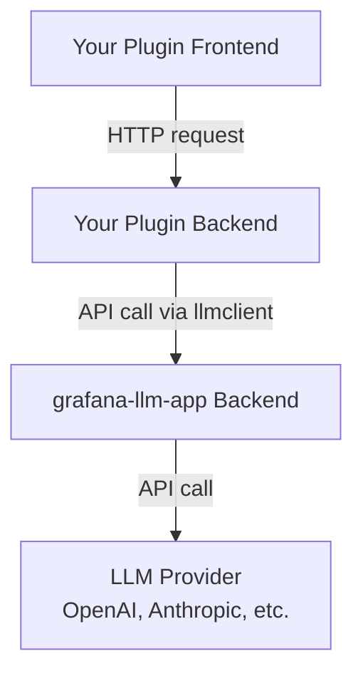

# Grafana LLM App Integration Guide

This document defines how to integrate with the **grafana-llm-app** plugin for LLM capabilities in Grafana plugins.

## Overview

The **grafana-llm-app** is a Grafana plugin that provides:

- LLM provider abstraction (OpenAI, Azure OpenAI, Anthropic, etc.)
- Unified API for LLM interactions
- Streaming support via Server-Sent Events (SSE)
- Frontend library (`@grafana/llm`) and backend Go client (`llmclient`)

**Architecture**: Monorepo with tightly coupled frontend package and backend plugin.

## Integration Architecture

### High-Level Flow



**Security Model**:

- User authentication flows through your backend to grafana-llm-app
- grafana-llm-app handles provider credentials securely
- Your plugin never sees provider API keys

## Official Grafana LLM Integration Patterns

### Requirements

**Minimum versions**:

- Grafana LLM app plugin: v0.22+ (for MCP support)
- `@grafana/llm` npm package: Latest version
- Grafana: 10.0+

### Frontend Integration (Official Pattern)

**Installation**:

```json
{
  "dependencies": {
    "@grafana/llm": "^1.0.1"
  }
}
```

**Basic LLM Usage**:

```typescript
import { llm, isLLMPluginEnabled } from '@grafana/llm';

// ALWAYS check if LLM plugin is available
if (!isLLMPluginEnabled()) {
  console.warn('LLM plugin is not available');
  return;
}

// Basic completion
const response = await llm.chatCompletions({
  model: llm.LLM_MODEL.BASE, // Cost-effective option
  messages: [
    {
      role: 'system',
      content: 'You are a helpful assistant for Grafana metrics.',
    },
    {
      role: 'user',
      content: 'What is Prometheus?',
    },
  ],
});

console.log(response.choices[0].message.content);
```

**Streaming Responses**:

```typescript
import { llm, accumulateContent } from '@grafana/llm';
import { Observable } from 'rxjs';

// Stream LLM response for progressive UI updates
const stream$: Observable<string> = llm.streamChatCompletions({
  model: llm.LLM_MODEL.BASE,
  messages: [...]
}).pipe(
  accumulateContent() // Helper to build complete text from chunks
);

stream$.subscribe({
  next: (content) => {
    setResponse(content); // Update UI progressively
  },
  error: (err) => {
    console.error('Streaming error:', err);
  },
  complete: () => {
    console.log('Stream complete');
  }
});
```

### Model Context Protocol (MCP) - Agent Pattern

**MCP** enables LLMs to execute tools and gather real-time data, creating **agents** that actively interact with Grafana.

**Workflow**:

1. Setup MCP client with plugin identification
2. Retrieve available tools
3. Send tools with LLM requests
4. Process tool calls in a loop until LLM completes

**MCP Client Setup**:

```typescript
import { MCPClient, MCPClientProvider, useMCPClient } from '@grafana/llm';
import { ErrorBoundary } from 'react-error-boundary';
import { Suspense } from 'react';

// Wrap app with MCP provider
function App() {
  return (
    <ErrorBoundary fallback={<div>Error loading MCP client</div>}>
      <Suspense fallback={<div>Loading...</div>}>
        <MCPClientProvider pluginId="your-plugin-id">
          <YourComponent />
        </MCPClientProvider>
      </Suspense>
    </ErrorBoundary>
  );
}

// Use MCP client in components
function YourComponent() {
  const mcpClient = useMCPClient();

  const runAgent = async () => {
    // Get available tools
    const tools = await mcpClient.listTools();

    // Send request with tools
    let messages = [
      { role: 'system', content: 'You are an agent that can query Grafana data.' },
      { role: 'user', content: 'What is the CPU usage right now?' },
    ];

    while (true) {
      const response = await llm.chatCompletions({
        model: llm.LLM_MODEL.BASE,
        messages,
        tools, // Include available tools
      });

      const message = response.choices[0].message;

      // If no tool calls, we're done
      if (!message.tool_calls || message.tool_calls.length === 0) {
        return message.content;
      }

      // Execute tool calls
      messages.push(message);
      for (const toolCall of message.tool_calls) {
        const result = await mcpClient.callTool(toolCall.function.name, JSON.parse(toolCall.function.arguments));

        messages.push({
          role: 'tool',
          tool_call_id: toolCall.id,
          content: JSON.stringify(result),
        });
      }
    }
  };

  return <button onClick={runAgent}>Run Agent</button>;
}
```

### Error Handling (Official Recommendations)

**Always verify LLM availability**:

```typescript
import { isLLMPluginEnabled } from '@grafana/llm';

if (!isLLMPluginEnabled()) {
  // Graceful degradation - hide LLM features
  return <div>LLM features are not available. Please install grafana-llm-app.</div>;
}
```

**Troubleshooting checklist**:

1.  Check plugin installed: Administration > Plugins > "grafana-llm-app"
2.  Verify configuration: Test connection in LLM app settings
3.  Monitor network: Check browser DevTools for failed API requests
4.  Confirm versions: MCP requires LLM app v0.22+
5.  Add logging: Log client state for debugging

**Error boundaries**:

```typescript
import { ErrorBoundary } from 'react-error-boundary';

<ErrorBoundary
  fallback={<div>LLM features temporarily unavailable</div>}
  onError={(error) => console.error('LLM error:', error)}
>
  <LLMFeature />
</ErrorBoundary>;
```

## Alternative: Backend Proxy Pattern (This Plugin's Approach)

**This plugin uses a custom backend proxy pattern** instead of direct frontend LLM calls for enhanced security and control.

### Usage Pattern

```typescript
import { llm } from '@grafana/llm';

// The @grafana/llm package provides utilities for:
// - LLM request formatting
// - Stream handling
// - Error management
```

**Note**: This plugin implements a **custom backend proxy pattern** instead of direct frontend usage:

- Frontend calls our backend `/llm/chat` endpoint
- Backend constructs secure system prompts
- Backend injects context and skills automatically
- Backend proxies to grafana-llm-app with proper auth

See: `src/services/assistantService.ts` and `pkg/plugin/llm_client.go`

## Backend Integration

### Go Client Setup

**Import the llmclient package**:

```go
// Note: llmclient is part of the grafana-llm-app repository
// You need to vendor it or use Go modules
import "github.com/grafana/grafana-llm-app/pkg/llmclient"
```

**This plugin implements custom client** in `pkg/plugin/llm_client.go`:

- Constructs requests to grafana-llm-app API
- Handles SSE streaming responses
- Manages user authentication headers
- Provides retry logic and error handling

### API Endpoints

#### Chat Completion (Streaming)

```
POST /api/plugins/grafana-llm-app/resources/llm/chat
```

**Request**:

```json
{
  "model": "gpt-4",
  "messages": [
    {
      "role": "system",
      "content": "You are a helpful assistant."
    },
    {
      "role": "user",
      "content": "What is Prometheus?"
    }
  ],
  "stream": true,
  "temperature": 0.7
}
```

**Response**: Server-Sent Events (SSE) stream

```
data: {"choices":[{"delta":{"content":"Prometheus"}}]}

data: {"choices":[{"delta":{"content":" is"}}]}

data: [DONE]
```

#### Chat Completion (Non-Streaming)

Same endpoint, set `"stream": false` for complete response.

### Authentication Pattern

**User Context Forwarding**:

```go
// Extract user from Grafana request context
user := backend.PluginConfigFromContext(ctx).User

// Forward user authentication headers to grafana-llm-app
req.Header.Set("X-Grafana-User", user.Login)
req.Header.Set("X-Grafana-Org-ID", strconv.FormatInt(user.OrgID, 10))
```

**This plugin's implementation**: `pkg/plugin/llm_client.go::makeRequest()`

### Streaming Implementation

**SSE Parsing Pattern**:

```go
scanner := bufio.NewScanner(resp.Body)
for scanner.Scan() {
    line := scanner.Text()

    if strings.HasPrefix(line, "data: ") {
        data := strings.TrimPrefix(line, "data: ")

        if data == "[DONE]" {
            break
        }

        // Parse JSON chunk
        var chunk StreamChunk
        json.Unmarshal([]byte(data), &chunk)

        // Forward to client via SSE
        streamWriter.Write(chunk)
    }
}
```

**This plugin's implementation**: `pkg/plugin/llm_client.go::ChatStream()`

### Function Calling (Tool Use)

**Request with tools**:

```json
{
  "model": "gpt-4",
  "messages": [...],
  "tools": [
    {
      "type": "function",
      "function": {
        "name": "query_prometheus",
        "description": "Execute a PromQL query",
        "parameters": {
          "type": "object",
          "properties": {
            "query": {
              "type": "string",
              "description": "PromQL query expression"
            }
          },
          "required": ["query"]
        }
      }
    }
  ],
  "tool_choice": "auto"
}
```

**Response with tool call**:

```json
{
  "choices": [
    {
      "message": {
        "role": "assistant",
        "tool_calls": [
          {
            "id": "call_abc123",
            "type": "function",
            "function": {
              "name": "query_prometheus",
              "arguments": "{\"query\":\"up\"}"
            }
          }
        ]
      }
    }
  ]
}
```

**This plugin implements function calling** in:

- `pkg/plugin/assistant_tools.go` - Tool definitions
- `src/services/zagalinTools.ts` - Tool execution handlers

## Provider Configuration

### Supported Providers

grafana-llm-app includes built-in support for:

1. **OpenAI** (GPT-4, GPT-3.5)
2. **Azure OpenAI** (Enterprise deployments)
3. **Anthropic** (Claude models)

### Configuration Structure

**In Grafana plugin settings**:

```json
{
  "provider": "openai",
  "openai": {
    "url": "https://api.openai.com/v1",
    "organizationId": "org-xyz"
  },
  "secureJsonData": {
    "openaiKey": "sk-..."
  }
}
```

**Anthropic Example**:

```json
{
  "provider": "anthropic",
  "anthropic": {
    "url": "https://api.anthropic.com/v1"
  },
  "secureJsonData": {
    "anthropicKey": "sk-ant-..."
  }
}
```

### Model Mapping

grafana-llm-app provides abstract model types:

- `gpt-4` → Provider-specific model ID
- `gpt-3.5-turbo` → Provider-specific model ID
- `claude-3-opus` → Provider-specific model ID

**Model selection in this plugin**: `pkg/plugin/assistant.go::handleLLMChat()`

## Security Best Practices

### DO:

**Always proxy through your backend** - Never call grafana-llm-app from frontend
**Forward user context** - Include user authentication headers
**Validate input on backend** - Sanitize user messages before sending to LLM
**Sanitize output** - Use DOMPurify on LLM responses before rendering
**Implement rate limiting** - Prevent abuse and control costs
**Log LLM requests** - Audit trail for debugging and cost tracking
**Set reasonable timeouts** - LLM calls can be slow
**Handle errors gracefully** - LLM APIs can fail

### DON'T:

**Don't store API keys in frontend** - Use secure backend storage
**Don't trust LLM output** - Always sanitize before rendering
**Don't skip rate limiting** - LLM calls are expensive
**Don't expose raw errors to users** - Sanitize error messages
**Don't bypass user authentication** - Always include user context
**Don't hardcode provider URLs** - Use configuration
**Don't ignore streaming errors** - Handle SSE disconnections

## Implementation Patterns

### Pattern 1: Backend Proxy (Recommended)

**Advantages**:

- Secure system prompts (not visible to frontend)
- Automatic context injection
- Rate limiting and cost control
- Audit logging with user identity
- Function calling with secure execution

**This plugin uses this pattern**:

1. Frontend: `assistantService.sendMessage()` → Backend `/llm/chat`
2. Backend: Construct secure prompt + inject context
3. Backend: Call grafana-llm-app with user auth
4. Backend: Stream response back to frontend via SSE

**Files**:

- `src/services/assistantService.ts` - Frontend client
- `pkg/plugin/assistant.go` - Backend handler
- `pkg/plugin/llm_client.go` - grafana-llm-app client
- `pkg/plugin/assistant_prompts.go` - Secure system prompts

### Pattern 2: Direct Frontend (Not Recommended)

**Use only for**:

- Simple chat interfaces with no security concerns
- Prototypes and demos
- Public-facing chatbots with no sensitive data

**Limitations**:

- System prompts visible in frontend code
- No backend validation
- Difficult to implement rate limiting
- No audit logging

## Testing Integration

### Development Sandbox

grafana-llm-app provides a **developer sandbox** in dev mode:

- Access: `http://localhost:3000/plugins/grafana-llm-app`
- Test LLM providers end-to-end
- Validate streaming responses
- Test function calling

### Mocking LLM Responses

**For unit tests**, mock the grafana-llm-app client:

```go
type MockLLMClient struct {
    Response string
    Error error
}

func (m *MockLLMClient) Chat(ctx context.Context, req ChatRequest) (ChatResponse, error) {
    if m.Error != nil {
        return ChatResponse{}, m.Error
    }
    return ChatResponse{Content: m.Response}, nil
}
```

**Frontend mocking**:

```typescript
jest.mock('@grafana/llm', () => ({
  llm: {
    chat: jest.fn().mockResolvedValue({
      content: 'Mocked response',
    }),
  },
}));
```

## Performance Optimization

### Streaming Benefits

- **Perceived latency**: Users see responses immediately
- **Error recovery**: Can handle partial responses
- **Cost control**: Can cancel expensive requests early

### Caching Strategies

- **Context caching**: Cache Prometheus metrics, Loki streams
- **Response caching**: Cache common queries (short TTL)
- **Prompt templates**: Reuse prompt structures

**This plugin implements context caching**: `pkg/plugin/context/manager.go`

### Rate Limiting

- Implement token bucket algorithm per user
- Set per-minute and per-day limits
- Track LLM token usage for cost control

**This plugin's rate limiting**: `pkg/plugin/guardrails.go`

## Troubleshooting

### grafana-llm-app Not Responding

```
Error: grafana-llm-app plugin not found
```

**Solution**: Install and enable grafana-llm-app:

```bash
grafana-cli plugins install grafana-llm-app
grafana-server restart
```

### Authentication Errors

```
Error: Unauthorized
```

**Solution**: Verify user context headers are forwarded:

```go
req.Header.Set("X-Grafana-User", user.Login)
req.Header.Set("X-Grafana-Org-ID", strconv.FormatInt(user.OrgID, 10))
```

### Streaming Disconnections

```
Error: SSE connection lost
```

**Solution**:

- Implement retry logic with exponential backoff
- Handle `[DONE]` marker properly
- Set appropriate timeouts (60s+ for LLM calls)

### Provider Configuration Missing

```
Error: No LLM provider configured
```

**Solution**: Configure grafana-llm-app in Grafana UI:

1. Navigate to grafana-llm-app settings
2. Select provider (OpenAI, Anthropic, etc.)
3. Enter API key in secure field
4. Test connection

## Adding New LLM Providers

If you need to extend grafana-llm-app with a new provider:

### Backend Implementation

1. Create `pkg/plugin/myprovider_provider.go`
2. Implement `LLMProvider` interface:
   ```go
   type LLMProvider interface {
       Models() []string
       ChatCompletion(ctx context.Context, req ChatRequest) (ChatResponse, error)
       ChatCompletionStream(ctx context.Context, req ChatRequest) (StreamReader, error)
   }
   ```
3. Register in `pkg/plugin/provider.go::createProvider()`

### Frontend Implementation

1. Add provider to `ProviderType` enum
2. Create `MyProviderConfig.tsx` component
3. Add settings interface with TypeScript types
4. Update `LLMConfig.tsx` with provider card

### Reference Implementation

See Anthropic provider PR: https://github.com/grafana/grafana-llm-app/pull/566

## Resources

- **grafana-llm-app Repository**: https://github.com/grafana/grafana-llm-app
- **Contributing Guide**: https://github.com/grafana/grafana-llm-app/blob/main/CONTRIBUTING.md
- **@grafana/llm NPM Package**: https://www.npmjs.com/package/@grafana/llm
- **This Plugin's Implementation**:
  - Backend: `pkg/plugin/llm_client.go`, `pkg/plugin/assistant.go`
  - Frontend: `src/services/assistantService.ts`
  - Tools: `pkg/plugin/assistant_tools.go`, `src/services/zagalinTools.ts`
